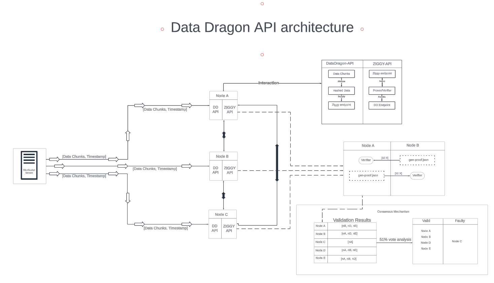

# DataDragon

### What is in this repo?

This repo contain the code to generate a groups of Node to simulate a Web3 Cloud Network with the ability to verify the content using ZK-STARKS Ziggy algoritmy and a groups of endpoints to generate a data stream.

### Problem this repo try to solve

The project provides a robust solution for the verification and validation of streaming data, leveraging a decentralized, node-based architecture. Its core functionality ensures the integrity and timestamping of data without reliance on central authorities, using state-of-the-art cryptographic proofs.

### Architecture



### Data Flow:

* Data Validation: data is validated by the experts in the matter in the community

* Data Acquisition: Data is streamed into the system via WebSocket connections.

* Data Processing: The DD API breaks the stream into chunks, timestamps them, and applies SHA-256 hashing.

* Data Verification: The ZIGGY API, utilizing zk-STARK proofs, verifies the integrity and authenticity of the data chunks.

* Consensus Building: Nodes participate in a consensus mechanism, with a 51% vote analysis to validate data.

* Block Chain: The verification of the data is register in the blockchain.

## Challenges and Solutions

### Simulating Nodes in Docker

* Challenge: Creating multiple, isolated environments for node simulation within Docker containers.

* Solution: Utilize Docker Compose to define multi-container Docker applications, allowing each node to operate within its own environment. Containers are configured to mimic the behaviour of separate nodes on the network.

### WebSocket Data Transmission

* Challenge: Establishing WebSocket connections from external sources into the Dockized environment.

* Solution: Configure Docker networking settings to expose specific ports to the host machine. Set up WebSocket listeners within the Flask application to accept connections on these ports.

### Security and Robustness

#### Encryption and Hashing
Data chunks are secured using SHA-256 hashing, providing a high level of cryptographic security. This ensures that even if data is intercepted, it cannot be reverse engineered.

#### Zero-Knowledge Proofs
The integration of zk-STARK proofs via ZIGGY API means data verification can be performed without revealing the data itself, maintaining privacy and security.

#### Deployment and Usage
The system is built for local deployment to facilitate demonstrations. Each component is containerized using Docker, ensuring that the simulation environment can be replicated consistently.

#### Setup

Docker Installation: Ensure Docker and Docker Compose are installed on the host machine.
Building Containers: Use Docker Compose to build containers for each node and API.

* Running Simulation: Start the system using Docker Compose, which initiates the nodes and establishes WebSocket connections for data streaming.

####  Operation

Streaming Data: Initiate data stream to WebSocket exposed by the Flask application.

* Verifying Data: Monitor the ZIGGY API for verification results and consensus outcomes.

### How to run Nodes and Development proces

You have the docker-compose,yml file to run it use the command:

```bash
docker-compouse up
```

if you made some change in the API of the node you need to rebuild the docker image and then run the docker-compuse comando:

Build image locally:

```bash
./build_api.sh
```

Run nodes:

```bash
docker-compouse up
```

If you made change in the ZKP API or code, you need to re build the docker image as well:

Build image locally:

```bash
./build_zkp.sh
```

Run nodes:

```bash
docker-compouse up
```

### #### Publish images in to the Docker Repo

To publish each image yo need to run:

Base zkp:

```bash
docker push agustinallamano/zkp:latest
```

Node data-dagron:

```bash
docker push agustinallamano/data-dagron:latest
```
